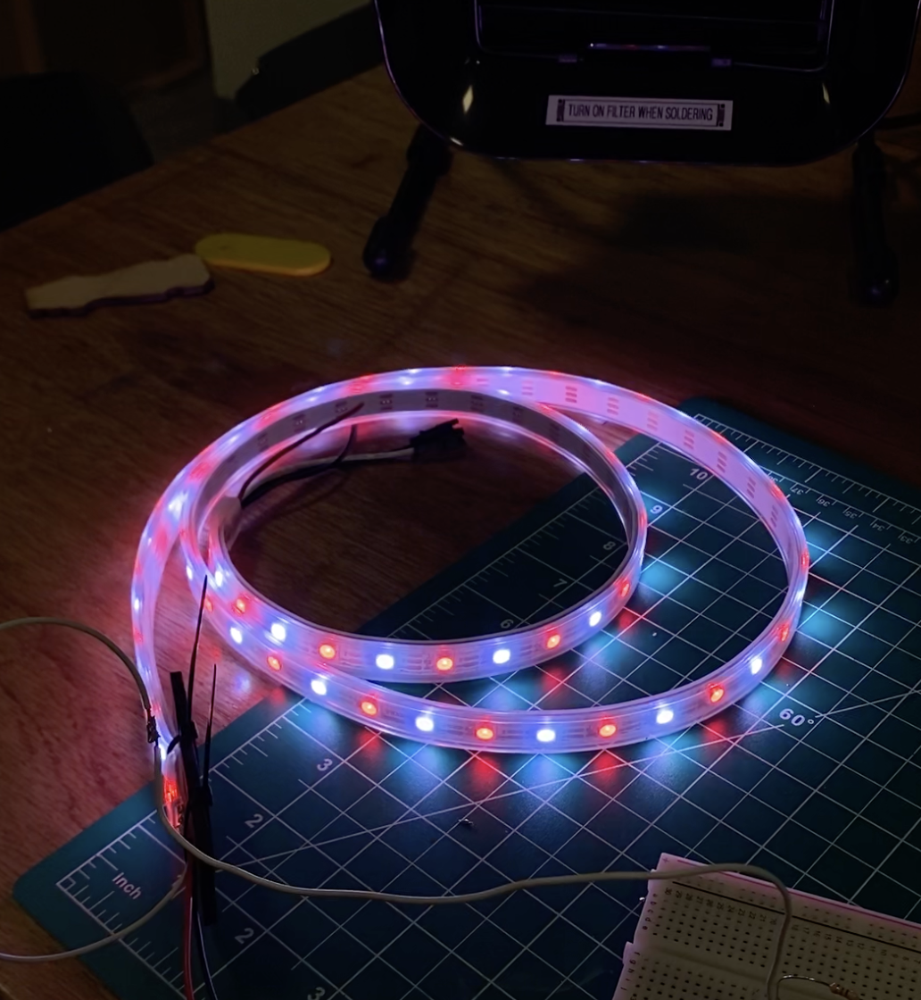
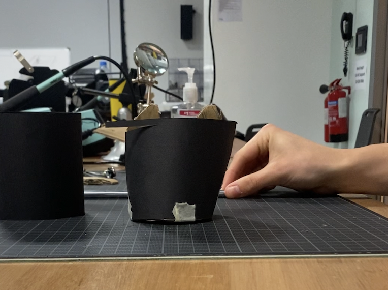
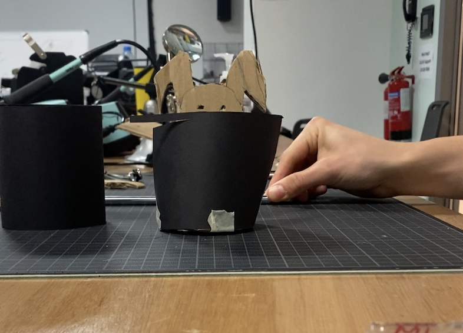
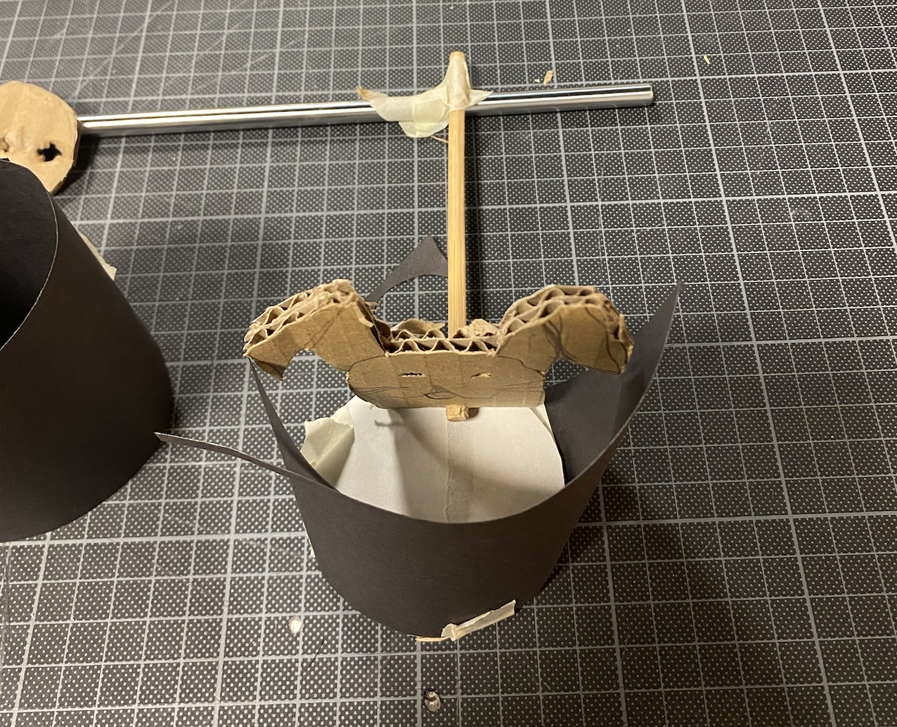
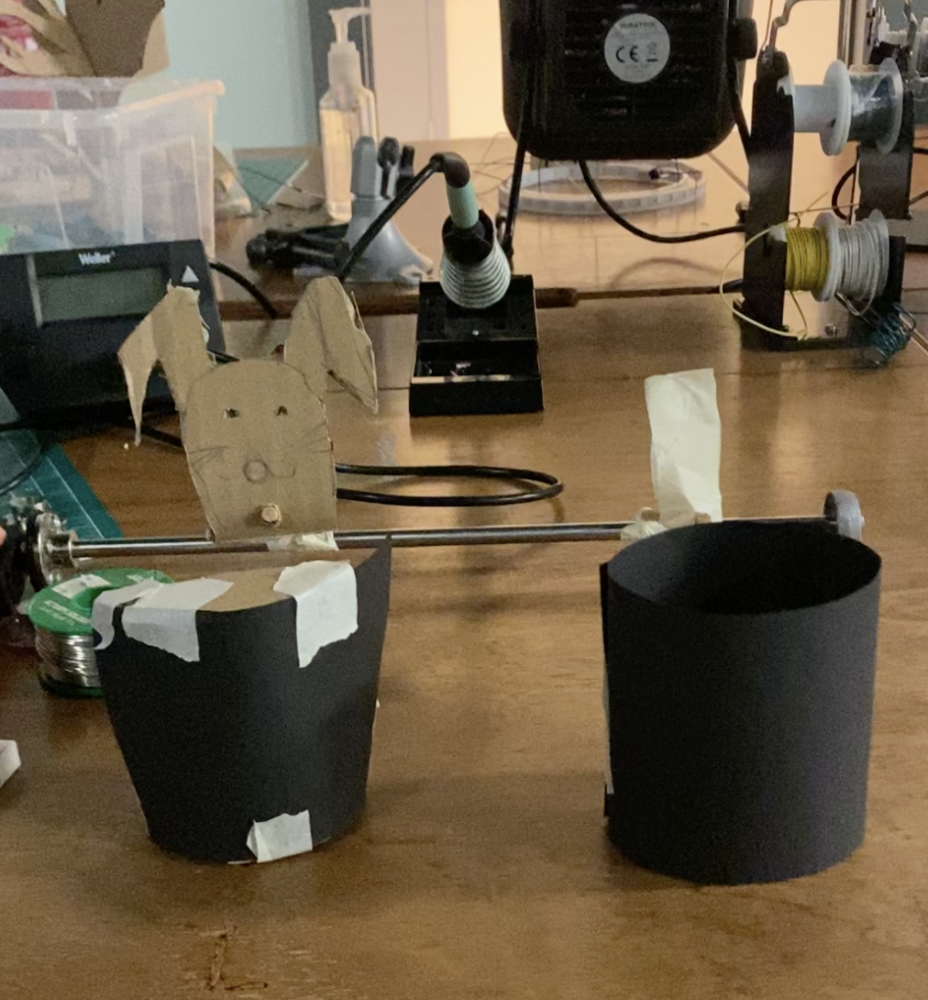

**NeoPixels**

Based on the last iteration's feedback, we focused on making the connection between the Neopixels and wires more secure, which would provide us with a more steady connection. First, we changed the wires from solid to stranded, and then used a little piece of wood from the railings we cut out and zip ties to make sure that the neopixel strip and the wires were not moving around too much on their weakest spot, which worked really well!

 

We also started working on the box for the signs - we came up with different designs and the next step is to laser cut and put the boxes together.

**Bunnies**

We have started working on the bunnies in the last week. First, we thought long and hard about how we could make the bunnies go up and down AND be stable at the same time. After some design iterations, we have settled on using some tricks to make it seem like the bunnies are moving inside the hat but actually have the rope attached to the bunnies from the back. Since we are already using a shaft and a motor to make a rotational movement, we thought it would not be so difficult in terms of figuring out how to add more bunnies. We decided we want to have two separate sets of bunnies that are positioned in a way that when half of the bunnies go up, the other half goes down, making every other bunny have a different position (in or out of hat)

  

We have figured out how to attach the shaft to the servo motor using an attachment that comes for the motor and are now in the middle of figuring out how the bunny attaches to the shaft. We imagine it to be something similar to the image below, but by attaching a wooden piece to a shaft coupling. In the demo video, you can see how we would have more than one bunnies moving together.  

 

**Tree**

We have laser cut and built the base of the tree :)
