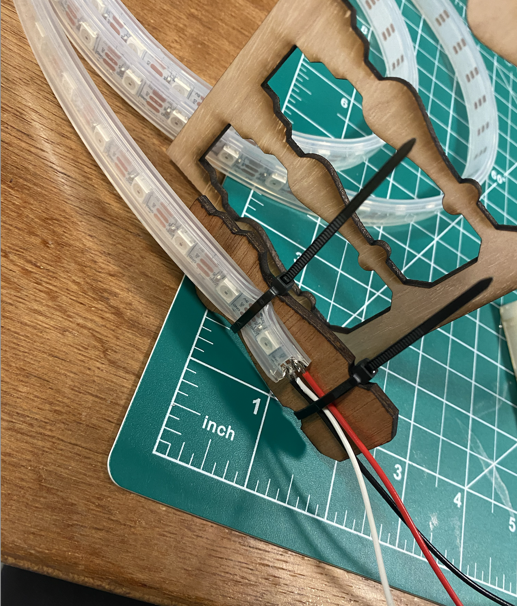

**NeoPixels**

Based on the last iteration's feedback, we focused on making the connection between the Neopixels and wires more secure, which would provide us with a more steady connection. First, we changed the wires from solid to stranded, and then used a little piece of wood from the railings we cut out and zip ties to make sure that the neopixel strip and the wires were not moving around too much on their weakest spot, which worked really well!

We also started working on the box for the signs - we came up with different designs and the next step is to laser cut and put the boxes together.

