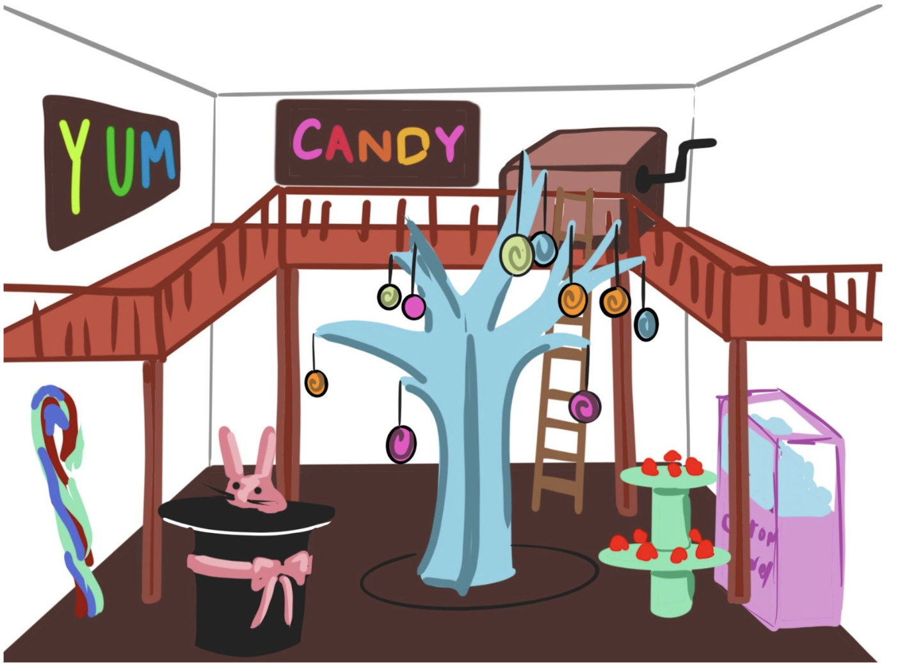
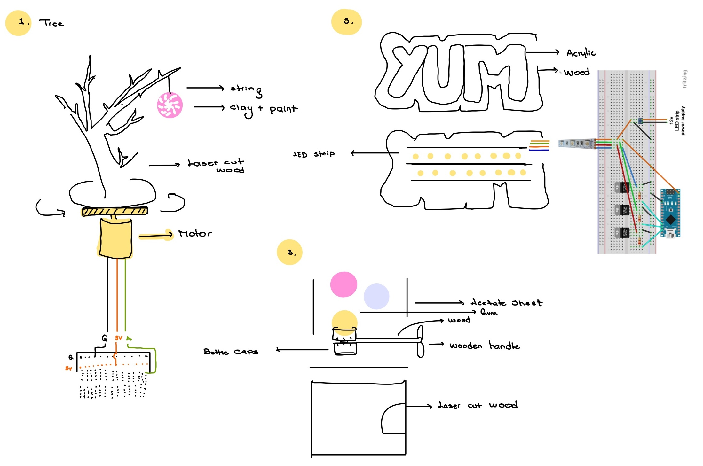
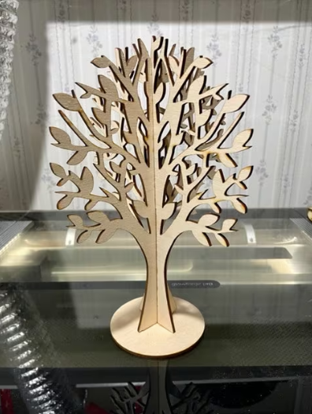
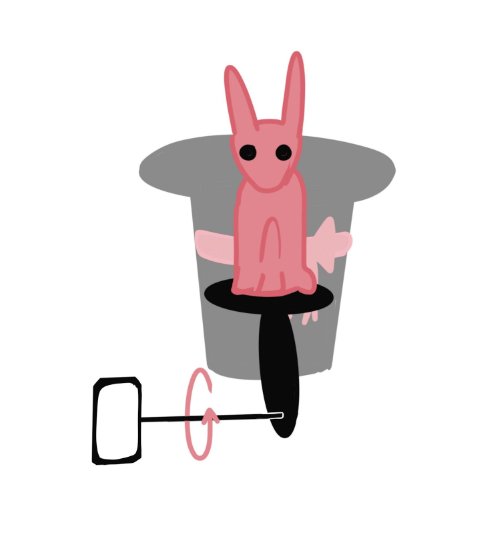

# Theme Park: Candy Shop

## Team Members:
- Aigerim
- Jackie
- Juanma

## Previous Homework Repository:
[Link to Previous Homework Repository](https://github.com/juanrozu23/MachineLab/blob/main/Homework/homework_05Feb.md)

### 1. With your team, sketch out your initial overall plan for your project.

a. The tree: We will use laser-cut wood to assemble a tree

b. [The gumball machine](https://www.hellowonderful.co/post/diy-cardboard-gumball-machine/) 

c. The music box: We were researching [how to make a music box](https://www.youtube.com/watch?v=_6zPhHdJTcM). The mechanism seems outside of our bandwidth, so we are considering using a speaker or a preexisting music box that we wind continuously with a servo motor

d. The signs: We will use neopixels, the laser cutter (wood & acrylic), and wires. 

### 2. Identify the most risky, complicated, or frightening element of your project. This is what you will work on first.
a. The tree

b. The gumball machine 

c. The music box

d. The signs 

### Make a rough sketch of how you will build this most frightening element. Include as many details as you can. After I review this, you will start building, so you should include whatever information you think you will need to start working. This also helps catch gaps in your concept.

a. The tree is divided into building the branches, making it move, and decorations. 
- [Laser Cut the tree base](https://3axis.co/laser-cut-decor-tree-jewelry-stand-cdr-file/eo0qgy01/)
- To move the tree, we will use a motor to make it spin from underneath
- Add details like cotton candy and lollipop - either laser cut or laminated paper

  
b. The bunny moves up and down as it is propelled below. A servo motor (continuous or not) spins a rod, which has a metal plate on the end. The metal plate is off-centered from the rod, such that as the rod spins, the bunny platform is pushed up and down

c. The signs will be illuminated from behind with an LED strip. The sign itself will be of laser-cut wood but will have holes where the letters and symbols are. Those holes will then be filled with acrylic.
